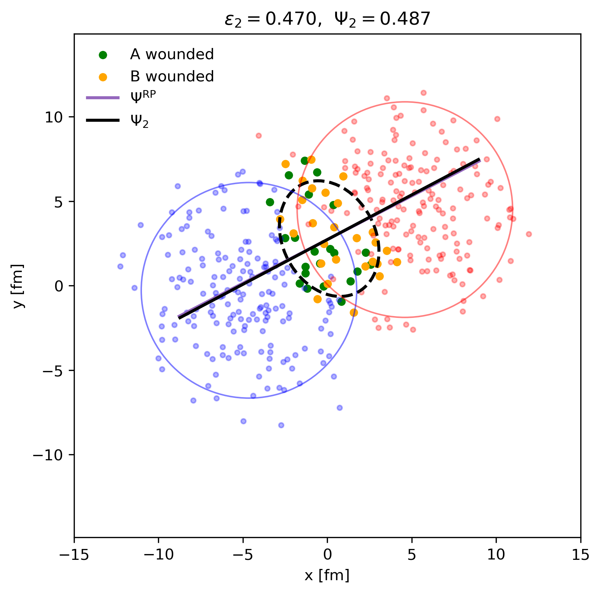

# Glauber simulation in Python using Fortran via f2py


## Overview
This repository contains a simple implementation of the Glauber model for simulating high-energy nuclear collisions using Python and Fortran. The Fortran code is compiled and interfaced with Python using `f2py`, allowing for efficient numerical computations.
The purpose of the simulation is not so much being correct, but rather to show how much computational gain can be achieved by using Fortran for the heavy numerical lifting while keeping the ease of use of Python for higher-level logic and data handling.

## Requirements
- Python 3.x
- Fortran compiler (e.g., gfortran)
- NumPy
- f2py 
- Matplotlib
- Meson
- Ninja

## Installation
1. Clone the repository:
   ```bash
    git clone
    cd glauber_simulation
    ```
2. Install the required Python packages (they are present in the requirements.txt):
    ```bash
    pip install -r requirements.txt
    ```
3. Install meson + ninja
    ```bash
    pip install meson ninja
    ```

4. Build the Fortran modules using f2py via the Makefile:
    ```bash
    make
    ```

## Usage
Run the simulation script:
```bash
python main.py --v <argument>
```
The arguments supported are:
- "py": runs the pure Python implementation. Without any arguments this is the default.
- "f": runs the Fortran implementation via f2py. Simulation loop is still in python, but all the heavy numerical lifting is done in Fortran.
- "pf": runs the pure Fortran implementation. The entire simulation loop is done in Fortran, and only the results are passed back to Python for visualization. This is still called via f2py.

There are also a plotting script which produces figures in the "figures" folder:
```bash
python plot_collision.py --v <argument>
```
The argument supported are:
- "col": plots a sample collision.
- "anim": creates an animation of the collision process.


The results from main.py are also saved as a plot in the "figures" folder, showing some different relevant observables, such as the number of participants as a function of impact parameter, but also the time the program took to run for the different implementations.

## Results
Here are some example results from the simulation:

This was mainly done to verify that the Fortran implementation produces the same results as the Python one. As well as showing that the result of the simulation is somewhat sane.

Animation of a sample collision:


Pure python implementation:


Fortran implementation via f2py:


Pure Fortran implementation:


## Performance
Reported for a range of b-values (0,20) in 0.05 increment step with 50 events generated per b.
The pure python code is quite clearly disadvantageous. With a total running time of 800 seconds. Just changing the generator to fortran as well as the collision finder, speeds up the program by a factor of ~270, which is not surprising as python struggles where loops are required.
Going from the part fortran to almost fully implemented fortran code only gains a factor of ~1.3 in gain. This is of course without any parallelization. It is quite clear that the while loop for generating events is the slowest part of the code in python, second is the collision finder. From there on, things can be optimized, but a significant gain in performance is unlikely to be achieved. The interesting part is also that since for the generator we are required to do a while loop, no vectorization can be done, and as such fortran or any other low level language is really required to increase the computational performance. 

## References
[1] https://arxiv.org/abs/nucl-ex/0701025 \
[2] https://tglaubermc.hepforge.org/ \
[3] https://arxiv.org/pdf/nucl-ex/0701025
