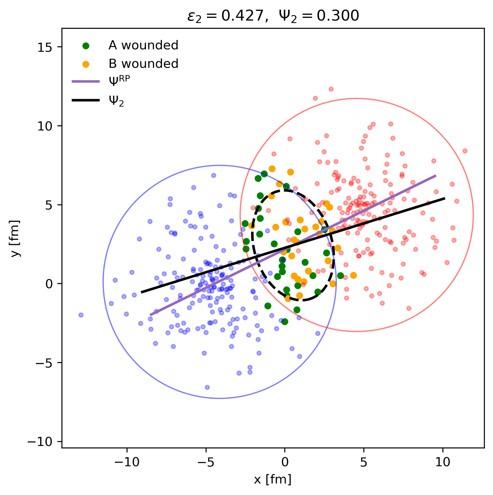
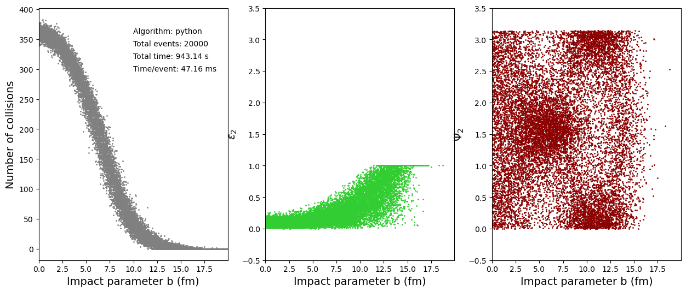
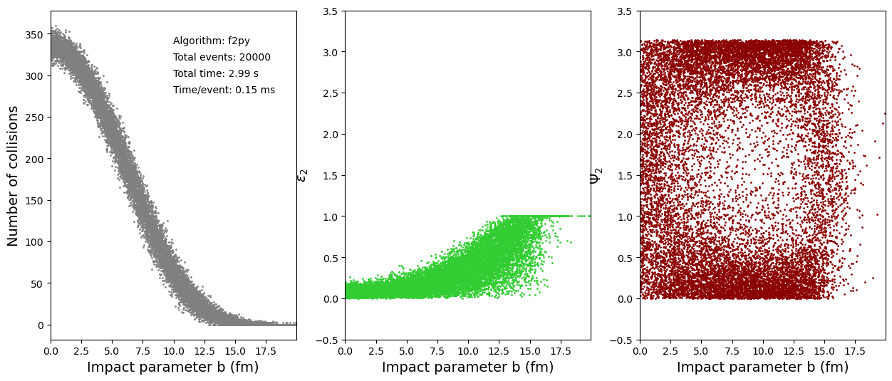
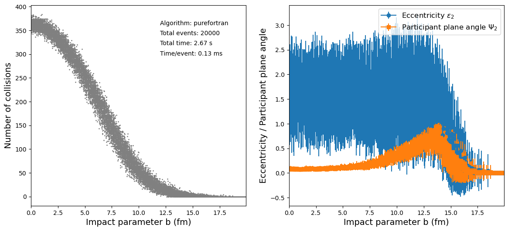

# Glauber simulation in Python using Fortran via f2py


## Overview
This repository contains a simple implementation of the Glauber model for simulating high-energy nuclear collisions using Python and Fortran. The Fortran code is compiled and interfaced with Python using `f2py`, allowing for efficient numerical computations.
The purpose of the simulation is not so much being correct, but rather to show how much computational gain can be achieved by using Fortran for the heavy numerical lifting while keeping the ease of use of Python for higher-level logic and data handling.

## Requirements
- Python 3.x
- Fortran compiler (e.g., gfortran)
- NumPy
- f2py 
- Matplotlib
- Meson
- Ninja

## Installation
1. Clone the repository:
   ```bash
   git clone
    cd glauber_simulation
    ```
2. Install the required Python packages (they are present in the requirements.txt):
    ```bash
    pip install -r requirements.txt
    ```
3. Install meson + ninja
    ```bash
    pip install meson ninja
    ```

4. Build the Fortran modules using f2py:
    ```bash
    make
    ```

## Usage
Run the simulation script:
```bash
python main.py --v <argument>
```
The arguments supported are:
- "python": runs the pure Python implementation. Without any arguments this is the default.
- "f": runs the Fortran implementation via f2py. Simulation loop is still in python, but all the heavy numerical lifting is done in Fortran.
- "pf": runs the pure Fortran implementation. The entire simulation loop is done in Fortran, and only the results are passed back to Python for visualization. This is still called via f2py.

There are also some plotting scripts which produces figures in the "figures" folder:
```bash
python plot_collision_with_RP.py 
```
Which plots a sample collision with the reaction plane and event plane indicated.

```bash
python collision_anim.py
```
Which produces a simple animation of a sample collision.

The results from main.py are also saved as a plot in the "figures" folder, showing some different relevant observables, such as the number of participants as a function of impact parameter, but also the time the program took to run for the different implementations.

## Results
Here are some example results from the simulation:

This was mainly done to verify that the Fortran implementation produces the same results as the Python one. As well as showing that the result of the simulation is somewhat sane.

Animation of a sample collision:


Pure python implementation:


Fortran implementation via f2py:


Pure Fortran implementation:


## Performance


